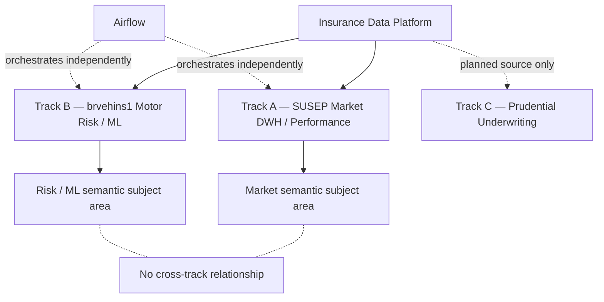
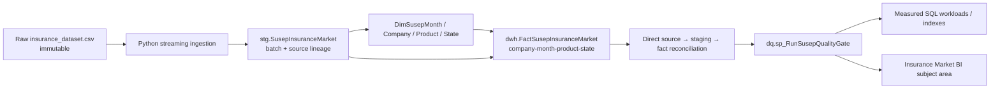
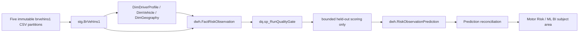
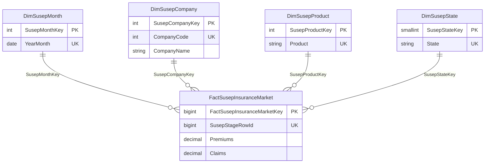
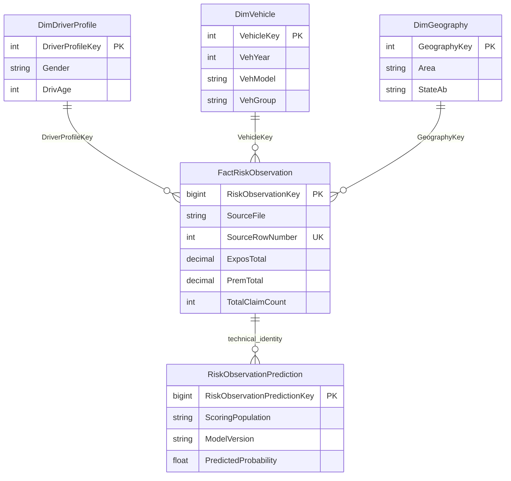
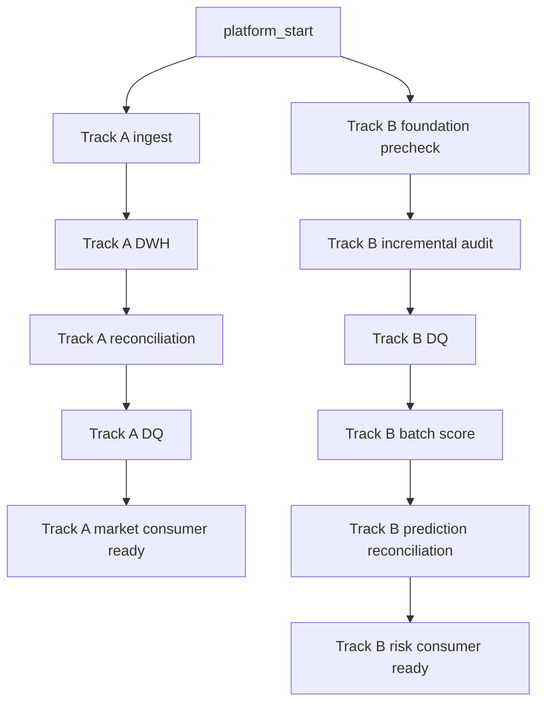
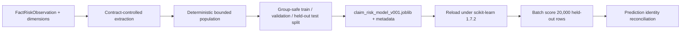
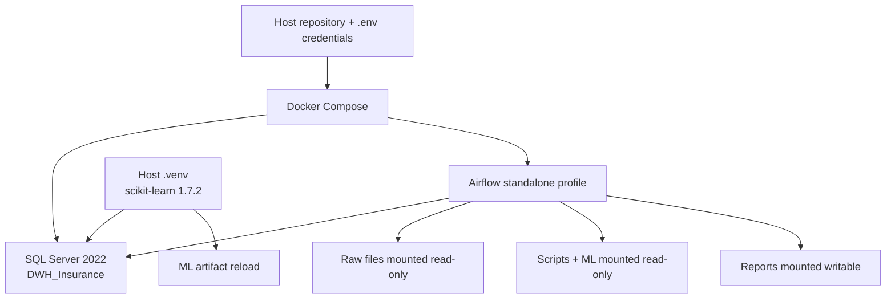

# Kiến trúc hiện hành — Insurance Data Platform

Tài liệu này mô tả kiến trúc **đang vận hành**, không phải scaffold lịch sử. Platform có hai data track độc lập theo grain và source identity. Chúng chia sẻ hạ tầng SQL Server/Airflow, nhưng không có join theo từng dòng.

## 1. Overall multi-track architecture

`No cross-track relationship` là một quy tắc dữ liệu, không phải thiếu sót kỹ thuật. SUSEP là quan sát thị trường; brvehins1 là quan sát rủi ro motor tổng hợp. Không source nào chứng minh customer, policy hay event key chung.

## 2. Track A — SUSEP flow

Loader fingerprints source file and skips an already successful source version. DWH load only inserts an unseen stage row. Vì vậy rerun không nhân bản dữ liệu.

## 3. Track B — brvehins1 flow

ML không phải retraining thường kỳ trong DAG. Nó reload artifact đã xác nhận, score population held-out theo contract, rồi kiểm tra technical identity.

## 4. SUSEP star schema

Một fact là một `company_code + year_month + product + state` observation. `Premiums` và `Claims` được lưu chung vì đến từ cùng grain. Source ratio là non-additive; BI phải derive ratio từ tổng Claims/Premiums thay vì cộng ratio nguồn.

## 5. brvehins1 star schema

Quan hệ prediction dùng identity kỹ thuật đã có trong contract Track B. Nó không tạo customer-level entity hoặc future-policy prediction.

## 6. Airflow DAG runtime

Hai nhánh không được nối bằng dependency giả. Khi Track A DQ fail, chỉ downstream Track A bị chặn; Track B tiếp tục theo policy độc lập của DAG.

## 7. ML lifecycle — Track B only

Artifact biểu diễn cross-sectional association với `HasClaim`, không phải claim probability tương lai cho customer/policy.

## 8. Docker/runtime architecture

Airflow chạy bằng Docker image riêng; host `.venv` dùng dependency ML đã pin cho artifact. Raw mounts đều read-only và không được mutation bởi runtime nào.
