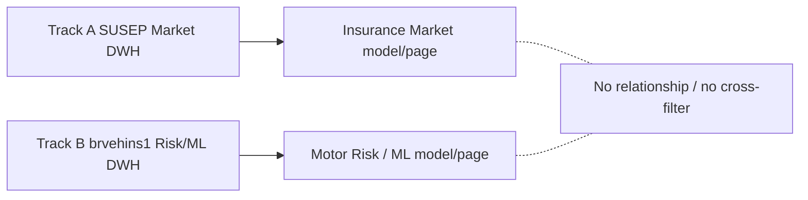

# Power BI semantic model — Insurance Data Platform

## Có một model chung cho hai track không?

Không. Power BI có hai **subject area** (vùng câu hỏi nghiệp vụ) độc lập trong cùng platform:



Không có cross-filter, bridge hay relationship giữa Track A và Track B. Có cùng domain “insurance” không tạo shared customer/policy key.

## Subject area A — Insurance Market

### Tables và relationships

- Fact: `dwh.FactSusepInsuranceMarket`, grain company-month-product-state.
- Dimensions: `DimSusepMonth`, `DimSusepCompany`, `DimSusepProduct`, `DimSusepState`.
- Bốn relationship one-to-many, single direction từ mỗi dimension sang fact.

### Measures đề xuất

```DAX
Premium = SUM ( FactSusepInsuranceMarket[Premiums] )
Claims = SUM ( FactSusepInsuranceMarket[Claims] )
Market Ratio (derived) = DIVIDE ( [Claims], [Premium] )
Market Observations = COUNTROWS ( FactSusepInsuranceMarket )
```

Không dùng `SUM(ClaimPremiumRatio)`. Source ratio là non-additive và phải hiện với nhãn `Source Claim Premium Ratio` nếu cần audit; dashboard nên dùng derived ratio có denominator guard.

### Dashboard questions

Trend premium/claims theo tháng; company/product mix; comparison theo state; segment có derived ratio bất thường. Giá trị âm là source accounting characteristic, không bị lọc lén.

## Subject area B — Motor Risk / ML

### Tables và relationships

- Fact: `dwh.FactRiskObservation`, grain aggregate risk observation của source brvehins1.
- Dimensions: `DimDriverProfile`, `DimVehicle`, `DimGeography`.
- Predictions: `dwh.RiskObservationPrediction` nối bằng technical source identity theo existing contract; chỉ population `bounded_held_out_test`, version model hiện hành.

### Measures đề xuất

```DAX
Risk Observations = COUNTROWS ( FactRiskObservation )
Exposure = SUM ( FactRiskObservation[ExposTotal] )
Premium = SUM ( FactRiskObservation[PremTotal] )
Claim Count = SUM ( FactRiskObservation[TotalClaimCount] )
Claim Amount = SUM ( FactRiskObservation[TotalClaimAmount] )
Observed Claim Rate = DIVIDE ( [Claim Count], [Exposure] )
Average Risk Score = AVERAGE ( RiskObservationPrediction[PredictedProbability] )
```

`Average Risk Score` mô tả output của bounded cross-sectional ML demo. Nó không phải “future customer claim probability”.

## Cách build artifact thủ công khi có Power BI Desktop

1. Kết nối SQL Server `localhost,1433`, database `DWH_Insurance` với credential local.
2. Tạo model/page Market từ Track-A tables; tạo model/page Risk/ML tách biệt.
3. Tạo relationships chỉ trong từng subject area; tắt cross-track relationship suggestion.
4. Tạo các measure ở trên, đặt label/tooltip cho source ratio và ML limitation.
5. Refresh, kiểm tra row/measure totals với SQL reconciliation, rồi lưu `.pbix` hoặc PBIP theo toolchain được owner chọn.

## Status artifact

Repository không có Power BI Desktop, `pbi-tools` hay Power BI automation/PBIP toolchain. Vì vậy không có `.pbix` giả được tạo. Semantic design và build instructions đã hoàn tất; actual dashboard/refresh là `BLOCKED_MANUAL`.
