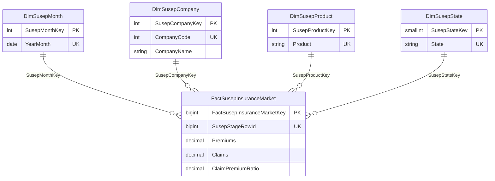

# Thiết kế DWH — Track A SUSEP Market

## Fact grain là gì?

`dwh.FactSusepInsuranceMarket` có đúng một fact cho mỗi accepted row ở `stg.SusepInsuranceMarket`. Grain là:

```text
company_code + year_month + product + state
```

Nó là “một quan sát market performance theo company-tháng-product-state”, không phải giao dịch premium riêng lẻ hay claim event.

## Vì sao premium và claims nằm trong một fact?

Hai measure đến cùng một dòng unique của source và có cùng four-part grain. Tách thành `FactPremium` và `FactClaims` sẽ nhân đôi lineage, dễ dẫn đến join/row explosion, nhưng không thêm thông tin. Một fact giống phiếu tổng hợp có cả “tiền premium” và “tiền claims”; tách hai nửa phiếu không làm dữ liệu chính xác hơn.

## Star schema gồm những gì?



Dimensions dùng surrogate key để fact nhỏ/ổn định và natural key unique để trace về source. Không có unknown member: bốn dimension field đều bắt buộc theo contract; tạo một “Unknown” sẽ che lỗi source thay vì giải thích nó.

## Company, product, state có ổn định không?

- `company_code` → `company_name` nhất quán trên file profiling hiện tại; load procedure sẽ chặn nếu một code có nhiều name.
- `product` là label/mã nguyên trạng source. Không có danh mục con hay mapping business được chứng minh, nên không tự tách mã/tên.
- `state` là code 2 ký tự source. Staging giữ 40 lexical value; DWH dùng `UPPER(state)` để map 103 lower/mixed-case variant vào 27 state code canonical. Không tạo region hierarchy chưa có mapping được kiểm chứng.
- `year_month` là ngày đầu tháng; dimension có year và month để filter/group.

## Measure nào additive, measure nào cần cẩn thận?

| Measure | Cách dùng đúng |
|---|---|
| `Premiums`, `Claims` | Có thể `SUM` trong một filter scope, nhưng giá trị âm nguồn có thể là accounting adjustment; nói rõ period/scope. |
| `SourceClaimPremiumRatio` | Non-additive. Không `SUM`, không `AVG` mặc định, không gọi nó là ratio tái tính. |
| Derived market ratio | Tính ở query/semantic layer: `SUM(Claims) / NULLIF(SUM(Premiums), 0)`. Nêu rõ handling cho zero/negative premium. |

## Lineage và rerun-safe như thế nào?

Fact chứa `SusepStageRowId` unique và copy `BatchId`, source file fingerprint, source row number/hash. Stored procedure chỉ insert `StageRowId` chưa có fact. Rerun không duplicate. Fact FK đến staging và bốn dimensions; do đó orphan key không thể được xem là dữ liệu hợp lệ.

## Không thiết kế gì và vì sao?

Không có `DimCustomer`, `DimPolicy`, SCD2, vehicle, exposure hoặc claim-event table. Các entity này không nằm trong schema SUSEP. Không có foreign key nào đến `FactRiskObservation` Track B hoặc Prudential Track C, vì platform-level integration không phải row-level relationship.
